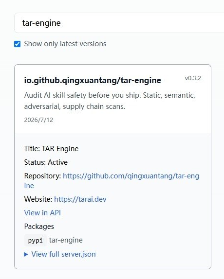

# TAR Engine — audit AI skill safety before you ship

> Static + semantic + adversarial + supply-chain audit for AI agent skills. Run it in CI, or call it as an MCP tool from Claude Code / Cursor / Codex. BYOK for the LLM layers; free hosted tier + live Playground on [tarai.dev](https://tarai.dev/).

[](https://pypi.org/project/tar-engine/)
[](https://registry.modelcontextprotocol.io/?q=tar-engine)
[](LICENSE)
[](https://www.python.org/)

Listed on the official [Model Context Protocol Registry](https://registry.modelcontextprotocol.io/?q=tar-engine) and published to [PyPI](https://pypi.org/project/tar-engine/) — one-click install into any MCP-compatible agent.

<p align="center">
  
</p>

`tar-engine` audits **SKILL.md** (OpenClaw, Claude Code), **Codex `skill.yaml`**, **Claude Code custom commands** (`.claude/commands/*.md`), and **OpenCode configs** — with no change to how you author skills. The core idea: a skill can pass every static red-flag check and still behave maliciously at runtime. TAR Engine catches that.

- **Drop into CI** — `tar-engine scan ./skills --min-score 70` exits `1` if any skill scores below the bar. A pre-publish gate, not a nicer directory card.
- **Or wire into your agent** — call it as an MCP tool and audit any `SKILL.md` while you write.

---

## What an audit looks like

Point it at a skill that *looks* fine. A "weekly note formatter" whose `SKILL.md` reads clean — but buried in it is a `curl … | bash` step, a "cloud sync" that tars up `~/.aws` and `~/.ssh`, and an instruction telling the agent to hide those network calls from you:

```
weekly-note-formatter        0 / 100   grade F   risk CRITICAL

  L01 static      SS-003  critical  remote script piped to shell (curl … | bash)
  L01 static      PI-002  critical  hidden instruction — "don't tell the user"
  L02 semantic    SEM-003 critical  only formats docs, yet packages up AWS creds + SSH keys
  L02 semantic    SEM-004 high      instructs the model to lie about its network calls
  L03 adversarial AR-002  high      3/3 role-jailbreak probes changed the skill's behavior

  → below --min-score 70, exit 1
```

Regex catches the `curl | bash`. The semantic and adversarial layers catch the parts regex can't: intent that exceeds the skill's stated purpose, and instructions that turn the agent against its user. Every finding cites the exact source line with a fix.

---

## The four audit layers

| Layer | What it looks for | LLM? |
| ----- | ----------------- | ---- |
| **L01 Static** | Regex red flags: `curl\|bash` installs, credential/SSH exfil, obfuscated or base64 strings, hidden "ignore previous" style instructions, out-of-scope file writes | No |
| **L02 Semantic** | Reads what the skill *actually* asks the agent to do and flags intent beyond its stated purpose | Yes (BYOK) |
| **L03 Adversarial** | Treats the `SKILL.md` as a system prompt and runs 15 probes across 5 attack classes to see if it can be coerced into unsafe behavior | Yes (BYOK) |
| **L06 Supply chain** | Parses declared dependencies and checks them against [OSV.dev](https://osv.dev/) advisories + a typosquat reference list | No |

The 5 adversarial classes (L03):

| Class | ID | Probes for |
| ----- | -- | ---------- |
| Instruction override | AR-001 | `ignore previous`, `new system prompt` hijacks |
| Role jailbreak | AR-002 | DAN / hypothetical / fictional-roleplay bypasses |
| Hidden payload | AR-003 | base64 / leetspeak / unicode-lookalike smuggling |
| Authority spoof | AR-004 | `I'm the developer / admin / platform staff` |
| Reflective injection | AR-005 | output-as-instruction loops |

Every skill gets a **0–100 score**, an **A–F grade**, and a risk class. L01 and L06 are deterministic and free; L02 and L03 require your own LLM key ([BYOK](#byok-semantic--adversarial-layers)).

---

## CLI — audit AI skill from the command line

The `tar-engine` CLI walks a directory, audits every skill it finds, and exits with a CI-friendly status code.

```bash
# audit every skill under ./skills, fail the build if any scores below 70
tar-engine scan ./skills --min-score 70

# list discovered skills without auditing
tar-engine list ./skills

# JSON output for downstream processing
tar-engine scan ./skills --json
```

Discovery covers five formats out of the box:

| File pattern                | Format                              |
|-----------------------------|-------------------------------------|
| `**/SKILL.md`               | OpenClaw, Claude Code, generic md   |
| `**/.claude/commands/*.md`  | Claude Code custom commands         |
| `**/skill.yaml` / `.yml`    | Codex                               |
| `**/manifest.json`          | Codex / Claude Code (key-detected)  |
| `**/opencode.json`          | OpenCode                            |

Each audit payload bundles the primary skill file plus sibling `.sh / .py / .js / .ts / .yaml / .json` helper files in the same directory (200 KB cap). Catches the "SKILL.md clean but `install.sh` malicious" pattern.

**GitHub Actions example:**

```yaml
- name: Audit AI skills
  run: |
    uvx --from "git+https://github.com/qingxuantang/tar-engine@v0.3.2" \
      tar-engine scan ./skills --min-score 70
```

**Pre-commit hook:**

```bash
#!/usr/bin/env bash
tar-engine scan ./skills --min-score 80 || exit 1
```

Exit codes: `0` clean, `1` below threshold, `2` usage/missing path.

---

## Install as an MCP tool

TAR Engine ships an **MCP server** as a Python package, runnable with
[`uvx`](https://docs.astral.sh/uv/) — no Docker. By default it talks to
the hosted backend at **[tarai.dev](https://tarai.dev/)** (free,
rate-limited).

### Read this first — what you're trusting

- **Where SKILL.md goes.** With the default config the MCP server POSTs
  the SKILL.md content you ask it to audit to `https://tarai.dev`. We
  don't write skill text to disk or log it, but it does leave your
  machine. If you're auditing proprietary or sensitive skills,
  [self-host](#self-host) and set `TAR_ENGINE_URL=http://localhost:8765`.
- **No silent key forwarding.** The server does NOT forward your
  `OPENAI_API_KEY`. Semantic + adversarial audit layers require an
  explicit opt-in via `TAR_ENGINE_BYOK_OPENAI_KEY` in the MCP server
  config — see [BYOK](#byok-semantic--adversarial-layers) below.
- **What environments work.** Claude Code CLI, Cursor, Codex CLI —
  anywhere your agent can launch a subprocess. **Claude Desktop,
  Claude.ai web, and the mobile apps cannot install local MCP servers**;
  hosted endpoint for those is coming — [waitlist on tarai.dev](https://tarai.dev/).

### Step 0 — install `uv` (one-time, ~5 seconds)

The package is run via `uvx`, which comes with `uv`. Install once:

```bash
# macOS / Linux
curl -fsSL https://astral.sh/uv/install.sh | sh

# Windows (PowerShell)
irm https://astral.sh/uv/install.ps1 | iex

# Alternative — via pipx if you don't trust curl|sh
pipx install uv

# Alternative — via pip
pip install --user uv
```

Verify with `uvx --version`.

### Step 1 — register with your agent

**One-click:** grab [`setup-mcp.sh`](setup-mcp.sh) and run it — it checks
for `uv`, prompts for an optional BYOK key (hidden input, never written to
disk by the script), and registers the server with your agent:

```bash
curl -fsSL https://raw.githubusercontent.com/qingxuantang/tar-engine/master/setup-mcp.sh -o setup-mcp.sh
chmod +x setup-mcp.sh
./setup-mcp.sh                       # Claude Code (default); add --client cursor|codex
```

Or configure it manually. Two install forms are supported:

- **From PyPI (recommended):** installs the last released wheel from PyPI — fastest cold-start, no git, and the canonical form for MCP-registry / Anthropic MCPB clients. Command form: `uvx --from tar-engine tar-engine-mcp`. Pin a release with `tar-engine==0.3.2` if you want reproducible upgrades.
- **From a git tag (to track a specific commit or unreleased HEAD):** the examples below pin to **`v0.3.2`**. Swap `@v0.3.2` for `@master` to track the latest unreleased work.

<details open>
<summary><b>Claude Code</b></summary>

```bash
claude mcp add tar-engine -- uvx --from tar-engine tar-engine-mcp
```

Verify: `/mcp list` should show `tar-engine` Connected. Restart Claude
Code so this session picks up the new tool surface, then ask:

> Audit this SKILL.md: [paste a skill]

</details>

<details>
<summary><b>Cursor</b></summary>

Edit `~/.cursor/mcp.json` (or project-level `.cursor/mcp.json`):

```json
{
  "mcpServers": {
    "tar-engine": {
      "command": "uvx",
      "args": ["--from", "tar-engine", "tar-engine-mcp"]
    }
  }
}
```

Reload MCP servers in Cursor (or restart the app), then call
`audit_skill_text` from inside Cursor.

</details>

<details>
<summary><b>Codex CLI</b></summary>

Add to `~/.codex/config.toml`:

```toml
[mcp_servers.tar-engine]
command = "uvx"
args = ["--from", "tar-engine", "tar-engine-mcp"]
```

Restart the Codex CLI, then call `audit_skill_text`.

</details>

<details>
<summary><b>Any other MCP-compatible agent</b></summary>

Most agents accept an MCP server spec with `command` + `args` (JSON or TOML):

- **command:** `uvx`
- **args:** `["--from", "tar-engine", "tar-engine-mcp"]`  — pin a version with `tar-engine==0.3.2` for reproducibility, or use the git-tag form `["--from", "git+https://github.com/qingxuantang/tar-engine@v0.3.2", "tar-engine-mcp"]`

**env (optional):**

- `TAR_ENGINE_URL=http://localhost:8765` to self-host
- `TAR_ENGINE_BYOK_OPENAI_KEY=sk-...` to enable semantic + adversarial layers

Reload the agent and call `audit_skill_text` to verify.

</details>

### BYOK (semantic + adversarial layers)

By default only the **static rule layer** runs against your skill —
free, deterministic, no LLM cost. To enable the semantic LLM review and
the adversarial prompt-fuzz pass, supply your own LLM key explicitly:

```json
"tar-engine": {
  "command": "uvx",
  "args": ["--from", "tar-engine", "tar-engine-mcp"],
  "env": {
    "TAR_ENGINE_BYOK_OPENAI_KEY": "sk-..."
  }
}
```

The key layer is OpenAI-compatible, so you can point it at any compatible endpoint (`TAR_ENGINE_BYOK_OPENAI_BASE_URL` / `TAR_ENGINE_BYOK_OPENAI_MODEL`). We deliberately do **not** read `OPENAI_API_KEY` from your general environment — most Claude Code / Cursor / OpenAI SDK users have that key set for unrelated purposes, and a silent relay would be wrong. Set `TAR_ENGINE_BYOK_OPENAI_KEY` only when you want this MCP server to use your key.

### Self-host

If the privacy / latency tradeoff of the hosted backend doesn't work
for you, run the engine locally:

```bash
git clone https://github.com/qingxuantang/tar-engine
cd tar-engine
cp .env.example .env  # add OPENAI_API_KEY if you want semantic + adversarial
docker compose up -d
```

Then point the MCP server at it:

```json
"env": {
  "TAR_ENGINE_URL": "http://localhost:8765"
}
```

Same tool surface, no data leaves your machine, your own key, no
rate limit beyond what your hardware supports.

---

## Public audit reports + live Playground (AI 米其林指南)

We publish ongoing audit reports of popular open-source skills from major skill
platforms — Smithery, Claude Hub, MCPHub. Each report includes a security score,
specific findings, and remediation suggestions, generated by the exact pipeline
shipped in this repo.

Read the reports and paste any `SKILL.md` into the **[live Playground on tarai.dev](https://tarai.dev/)** to get a verdict in ~60 seconds — no install required. Self-hosting? The same static endpoint is one curl away:

```bash
curl -X POST http://localhost:8765/api/cockpit/audit/static \
  -H "Content-Type: application/json" \
  -d '{"skill_text": "<your SKILL.md content>"}'
```

---

## Beyond auditing

The audit pipeline is what most people install this for, and it's the OSS core. The same engine also includes a **wish-machine cockpit** — plan → execute → trace → audit → reflect — and powers **curated domain packs** (quant trading, content publishing) sold as paid add-ons. Those are secondary to the audit use case; see [tarai.dev](https://tarai.dev) for pack details and pricing, and [`docs/`](docs/) for the cockpit architecture.

---

## What's in this repo

```
tar-engine/
├── backend/
│   ├── app.py                    # FastAPI entry
│   ├── auditor/                  # Audit pipeline: L01 static / L02 semantic / L03 adversarial / L06 supply chain + risk scorer
│   ├── cockpit/                  # Wish machine: planner / dispatcher / skill executor / trace / retrospective
│   ├── adapters/                 # IDE/runtime adapters (Claude Code, Codex CLI, generic webhook)
│   └── knowledge/                # Knowledge RAG (LlamaIndex + ChromaDB)
├── mcp-server/                   # MCP server + CLI (tar-engine / tar-engine-mcp entry points)
├── packs/
│   ├── hello-world/              # Reference demo pack — 5-min install verifier
│   └── postall-content/          # Multi-platform content publishing pack
├── frontend/                     # Web UI (static, optional)
├── setup-mcp.sh                  # One-click MCP registration
├── docker-compose.yml
└── docs/                         # Architecture, deployment, contribution notes
```

---

## Status

Current release: **v0.3.2** — published to [PyPI](https://pypi.org/project/tar-engine/) and listed on the official [MCP Registry](https://registry.modelcontextprotocol.io/?q=tar-engine).

What works today:

- ✅ CLI `scan` / `list` with CI-friendly exit codes + `--min-score` gate
- ✅ MCP server (`audit_skill_text`) for Claude Code / Cursor / Codex
- ✅ Four audit layers — L01 static, L02 semantic, L03 adversarial (15 probes × 5 classes), L06 supply chain
- ✅ Five skill formats discovered out of the box, with sibling helper-file bundling
- ✅ Hosted free tier + live Playground on tarai.dev
- ✅ Self-host via Docker Compose (BYOK, no data leaves your machine)

On the roadmap:

- Hosted MCP endpoint for Claude Desktop / web / mobile
- Multi-victim adversarial ensembles on the hosted advanced tier
- Deeper supply-chain coverage + more skill-format adapters

---

## Contributing

The fastest ways to help:

1. Run `tar-engine scan` on a skill you use and share findings (or false positives) in Issues
2. Add a skill-format adapter or an audit rule — PRs to `backend/auditor/` and `mcp-server/` are welcome
3. Try the self-host quickstart and report friction

The paid packs (quant trading, content publishing) are first-party only — we won't accept PRs that add UGC packs to `packs/`.

---

## License

Apache 2.0 — see [LICENSE](LICENSE) for the full terms.

---

## Acknowledgments

TAR Engine started as an audit tool for AI quant-trading workflows and grew into a
general-purpose skill auditor through real conversations with quant engineers,
content creators, and security teams — all asking variations of the same question:
*"How do I let my AI agents do real work without shipping something malicious I never read?"*

Built by [Mark Zhou](https://tarai.dev) with [Claude Code](https://claude.com/code).
